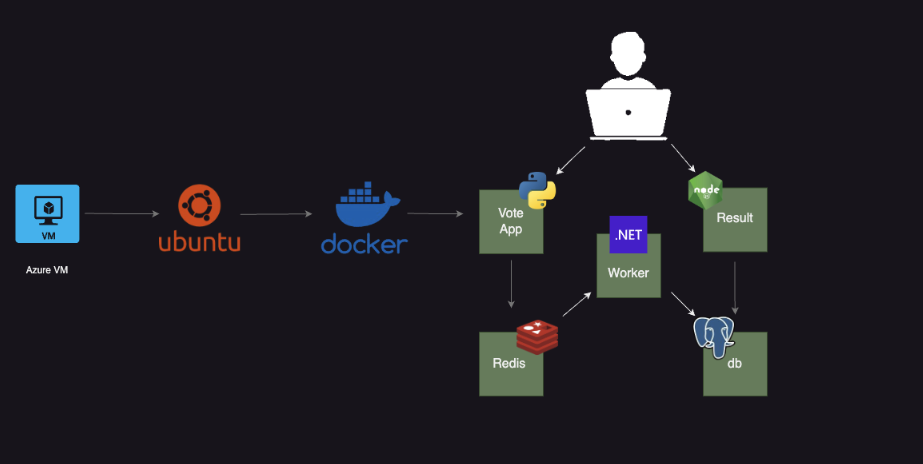

# Docker-Compose Voting Application

# Voting Application

This project demonstrates a complete voting application consisting of multiple services running in Docker containers. The architecture includes a Python front-end for voting, Redis for collecting votes, a .NET worker for processing, PostgreSQL for storing data, and a Node.js app for displaying results.

## Architecture Overview

The application is composed of the following components:

1. **Front-End Web App (Python)**: A simple front-end built in Python, allowing users to vote between two options.
2. **Redis**: A fast, in-memory data store that collects and temporarily stores the votes before processing.
3. **.NET Worker**: A backend worker service written in .NET that consumes the votes from Redis and stores them in a database.
4. **PostgreSQL Database**: A relational database that permanently stores the votes, backed by a Docker volume to persist data.
5. **Results Web App (Node.js)**: A Node.js application that displays the results of the voting in real time, based on data stored in PostgreSQL.

## Services

### 1. Front-End Voting App (Python)
This service allows users to submit their votes. Votes are sent to Redis for processing.

### 2. Redis
Redis acts as the message queue for incoming votes. Votes are stored temporarily before being processed by the .NET worker.

### 3. .NET Worker
The .NET worker service consumes the votes from Redis, processes them, and stores them in a PostgreSQL database.

### 4. PostgreSQL Database
The database is used to store the voting results. Data is persisted using Docker volumes, so it remains intact across container restarts.

### 5. Real-Time Results App (Node.js)
This service provides a real-time view of the voting results. It queries the PostgreSQL database to get the latest voting data and displays it to the user.

## Running the Application

Each component runs in its own Docker container, making it easy to deploy and scale. Follow these steps to set up and run the application:

### Prerequisites

- Docker installed on your system
- Docker Compose (version 3 or higher)

### Running the Services Using Docker-Compose (Version 3)

You can run all the services (Redis, PostgreSQL, voting app, worker, and result app) simultaneously using `docker-compose`. The following steps will guide you through it.

### 1. Create a `docker-compose.yml` File

Ensure your `docker-compose.yml` file looks like this:

```yaml
version: "3"
services:
  redis:
    image: redis

  db:
    image: postgres:9.4
    environment:
      POSTGRES_PASSWORD: postgres
      
  vote:
    image: voting-app
    ports:
      - 5000:80

  worker:
    image: worker-app

  result:
    image: result-app
    ports:
      - 5001:80
```
### 2. Build the Images 
 Navigate to the `vote` folder and build the Docker image for the front-end voting app:

```bash
    cd path/to/vote
    sudo docker build -t voting-app .
```
Pull Redis in the background to collect votes:

    ```bash
    sudo docker pull redis
    ```
Pull the PostgreSQL database Image:

    ```bash
    sudo docker pull postgres:9.4
    ```
Navigate to the `worker` folder, build the worker service, and run it:

    ```bash
    cd path/to/worker
    sudo docker build -t worker-app .

View the images you have pulled & Build:
```bash
sudo docker images
```

### 3. Run the Entire Application
You can now use the following command to build and run all the services:
```bash
sudo docker-compose up --build
```

## This will

- Build the voting-app, worker-app, and result-app images.
-Start the Redis and PostgreSQL containers.
-Start the voting and result applications on ports 5000 and 5001, respectively.
### 3. Accessing the Application
- Voting App: Visit http://localhost:5000 to cast your vote.
- Results App: Visit http://localhost:5001 to view the voting results in real time.


### 4.Stopping the Application
To stop all running services, use:
```bash
sudo docker-compose down
```
This will stop and remove all running containers.

### Running the Services Manually

1. **Build and Run the Voting App (Python)**

    Navigate to the `vote` folder and build the Docker image for the front-end voting app:

    ```bash
    cd path/to/vote
    sudo docker build -t voting-app .
    sudo docker run -d -p 5000:80 voting-app
    ```

2. **Run Redis**

    Run Redis in the background to collect votes:

    ```bash
    sudo docker run -d --name=redis redis
    ```

3. **Link the Voting App with Redis**

    Link the voting app with the Redis service:

    ```bash
    sudo docker run -d -p 5000:80 --link redis:redis voting-app
    ```

4. **Run PostgreSQL for the Worker App**

    Start the PostgreSQL database service:

    ```bash
    sudo docker run --name=db -e POSTGRES_PASSWORD=postgres postgres:9.4
    ```

5. **Build and Run the Worker App (.NET)**

    Navigate to the `worker` folder, build the worker service, and run it:

    ```bash
    cd path/to/worker
    sudo docker build -t worker-app .
    sudo docker run -d --link redis:redis --link db:db worker-app
    ```

6. **Build and Run the Results App (Node.js)**

    Navigate to the `result` folder, build the Docker image for the results app, and run it:

    ```bash
    cd path/to/result
    sudo docker build -t result-app .
    sudo docker run -d -p 5001:80 --link db:db result-app
    ```

### Viewing the Application

- **Voting App**: Visit `http://localhost:5000` to cast your vote.
- **Results App**: Visit `http://localhost:5001` to view the voting results in real time.

## Conclusion

This voting app demonstrates how to build a microservices-based application using multiple technologies such as Python, Redis, .NET, PostgreSQL, and Node.js. Each service is containerized with Docker, making it easy to deploy, scale, and manage.

